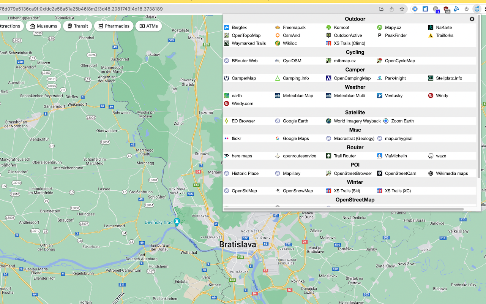
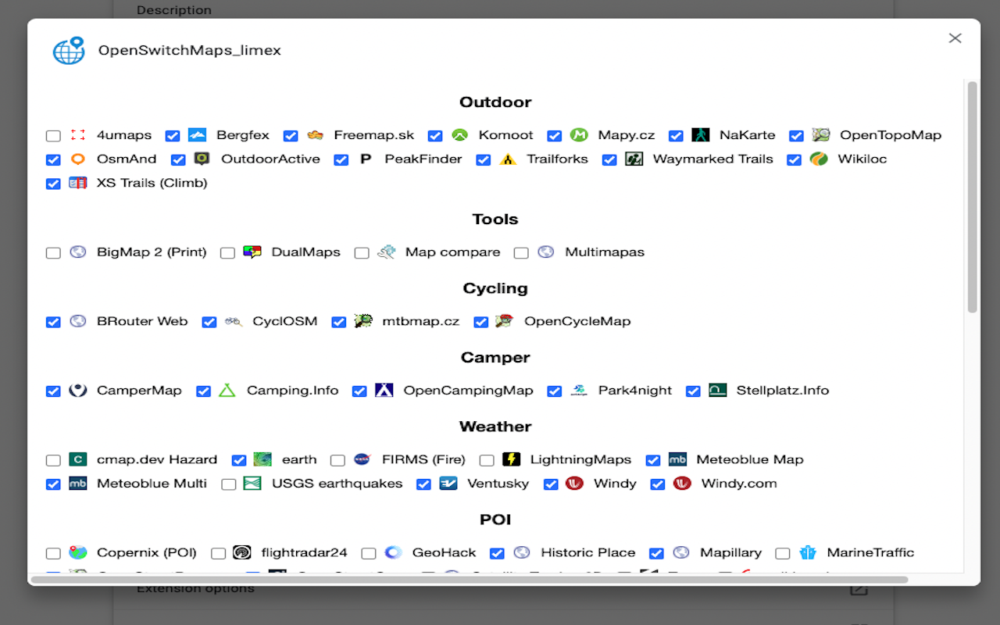

# OpenSwitchMaps (Manifest v3)

Map service switcher as Chrome Extension 

This is a fork from . Kudos for the great work!! Thanks!

## Motivation for fork (New Features & Fixes)

- Chrome Manifest v3
- Some cleanup done. Added new maps.
- Chanced the Categories, because some grew to big, while others remained small.
- Switched behavour in the Map Popup: Left Click now opens in new Tab, Middle Click opens in same Tab
- Sorted the Maps by Name
- Show Descriptions while MouseOver in Options Popup
- Existing Extension was listing the Categories in Columns. This limited the number of Categories. Also was a waste of space with smaller Categories. Solution: Render Categories in rows
- Some issues with v3 upgrade triggered removal of Firefox Browser Support, now Chrome only.
- For Performance/Usability Reasons, many map services where removed

## You are missing maps?

- Raise an [issue](https://github.com/limex/OpenSwitchMaps-v3/issues) in github. I might add it, if I like the map.
- But: I will DEFINITLY NOT add all the maps of the original Repo from tankaru.

## You still want that map added?

- Fork the code, [add it yourself](dev-howto.md).
- I didn't change the code segment, that lists the maps. It is easy to add your map, if you know Javascript. Or github copilot 😉

## Install

you have 3 options ...

### a) from Chrome Marketplace

- [Chrome webstore](https://chromewebstore.google.com/detail/openswitchmapslimexv3/ahkklpcjhdbcmfkikkifnaonfakmeiga)
- Opening the Dialogs on _first_ click take some seconds to show up. Be patient. :)

### b) Load unpacked dist directory from github

1. Download the /dist Directory from github (Clone the Code or Code -> Download ZIP) to a Directory of of your choice
1. Add to your Chrome/Firefox
   - Chrome: chrome://extensions/ -> Load unpacked

### b) from source code

[Development HowTo](dev-howto.md)

## How to use

1. Open Google map, for example (https://www.google.de/maps/place/Vienna/@48.2092464,16.850411,11z)
1. You will see an earth icon near URL bar. Click it.
1. Select OpenStreetMap, for example.
1. You can jump to OpenStreetMap at the same position
1. Left click: Open in a new tab. Middle click: Open the same tab.
2. Blue Extension Icon: You are on a suppored map.
3. Red Extension Icon: not supported map or any other random page.

## Settings

Show/hide maps:

1. click the earth icon,
1. Select "Options"
1. It might take some seconds for the popup to apear. Collecting all the data takes some time.
1. Check/uncheck each map to show/hide it.

## Screenshots

## Supported map services

1. **Google Maps** - Misc, Google Maps
2. **STRAVA Heatmap SUP** - Heatmap of all athletes, Water
3. **Bing** - Misc, Bing Maps
4. **OpenStreetMap** - OpenStreetMap, OSM
5. **Mapillary** - Crowdsourced street-level imagery available as CC BY-SA, POI
6. **PastVu** - Retro View, POI
7. **WikiShootMe** - Wikimedia, Flickr, POI
8. **Wandrer** - Hike Ride done, Cycling
9. **OWL Map** - Wikidata items, OSM
10. **Open Trip** - Sightseeing, POI
11. **WaterWayMap** - by length, navigable, Water
12. **flosm** - Watersport, Water
13. **ELWIS** - Wasserstraßen DE, Water
14. **Grade.de** - by length, navigable, Water
15. **OpenStreetCam** - Crowdsourced street-level imagery available as CC BY-SA, POI
16. **AlpenvereinActiv** - more than OA, Outdoor
17. **XC-Ski OA** - XC Routes, Winter
18. **OutdoorActive** - Tours for multiple Sports, Outdoor
19. **Freemap.sk** - Map and Features for Sk, Outdoor
20. **Wikiloc** - Trail & Waypoint Community, Outdoor
21. **Waymarked Trails** - Show hiking, cycling, ski routes, Outdoor
22. **Stellplatz.Info** - like Camping.info App, Camper
23. **DualMaps** - synchronized Maps, Aerial & Street View, Tools
24. **Camping.Info** - like Stellplatz.info, Camper
25. **BRouter Web** - Misc Maps, Custom Layer Overpass & XYZ, Cycling
26. **BRouter Grade.de** - Waterway Routing, Water
27. **Norgeskart** - Outdoor, POI, Outdoor
28. **Flussinfo** - North Germany only, Water
29. **Bikerouter** - Best bicycle routing on this planet, Cycling
30. **CamperMap** - Camper POIs, Camper
31. **OpenCamping** - Camping Sites, Camper
32. **OpenSkiMap** - Ski Slopes, Nordic Ski Trails, Winter
33. **Komoot Plan** - Plan for multiple Sports, Outdoor
34. **Komoot Discover** - Discover for multiple Sports, Outdoor
35. **Refuges Info** - Refuges, Parking, Busstation, Water, Outdoor
36. **Park4night** - Discover Overnight Parking, Camper
37. **Mapy.cz** - Outdoor with geotagged Pics, Outdoor
38. **Zoom Earth** - Daily Sat Images, Satellite
39. **mtbmap.cz** - Mountain Bike Map, Cycling
40. **XS Trails (XC)** - Cross Country Skiing, Winter
41. **XS Trails (Climb)** - Rock Climbing, Outdoor
42. **XS Trails (Ski)** - Backcountry Ski Mountaineering, Winter
43. **Overpass-turbo** - Power search tool for OpenStreetMap data, OSM
44. **Osmose** - OSM QA tool, OSM
45. **KeepRight** - OpenStreetMap QA tool, OSM
46. **OSM Inspector** - OpenStreetMap QA tool, OSM
47. **Who did it?** - OpenStreetMap QA tool, OSM
48. **Map compare** - Compare maps side-by-side, Tools
49. **Multimapas** - Compare maps by overlay, Tools
50. **map.orhyginal** - Portal of many map services, Misc
51. **NaKarte** - Heatmaps, Panorama, Streetview, ..., Outdoor
52. **Trailforks** - Outdoor Sport Trails, Outdoor
53. **Ventusky** - Weather, Wind, Snow, Waves, Rain, ..., Weather
54. **Meteoblue** - 7d Forecast, Maps Wind, Snow, Waves, Rain, ..., Weather
55. **Meteoblue Multi** - Multi Model 7d Forecast, Weather
56. **Windy** - WebCams on WeatherMap, Weather
57. **Bergfex** - Topo, Tracks, Tourism, Outdoor
58. **4umaps** - Topo, Trail difficulty, Outdoor
59. **BigMap 2 (Print)** - Obtain a composed big map image, Tools
60. **Satellite Tracker 3D** - Satellite tracker, POI
61. **earth** - Wind, Ocean, Chem, Particulates, Weather
62. **Windy.com** - Wind, Ocean, Chem, Particulates, Weather
63. **flightradar24** - Airplane tracker, POI
64. **Traze** - Train tracker, POI
65. **MarineTraffic** - Ship tracker, POI
66. **CyclOSM** - for Cyclists, Cycling
67. **OpenTopoMap** - Outdoor, Outdoor
68. **EO Browser** - Satellite sensing image viewer, Satellite
69. **Macrostrat** - Geological map, Weather
70. **Old maps online** - Historical maps, Misc
71. **Wikimedia maps** - Wikipedia POI, POI
72. **Open Infrastructure** - World's hidden infrastructure (Train, Power, Mobile, ...), Misc
73. **OSM Buildings** - 3D Buildings, Misc
74. **openrouteservice** - Directions, Router
75. **OpenRailwayMap** - Railway map, Misc
76. **OpenAerialMap** - Aerial imagery, Satellite
77. **Launch RapiD editor** - Facebook AI assisted OSM editor, OSM
78. **waze** - Crowdsourced route navigation map, Router
79. **here maps** - Directions, Router
80. **wikimap** - Wikipedia POI, POI
81. **wikimapia** - Multilingual open-content collaborative map, POI
82. **Copernix (POI)** - Show POIs from Wikipedia, POI
83. **GeoHack** - Map links for Wikipedia articles, POI
84. **Google Earth** - 3D Earth view, Satellite
85. **ArcGIS Wayback** - Historic satellite images since 2014, Satellite
86. **OpenGeofiction** - Crowdsourced fictional map, Misc
87. **Twitter** - Twitter location based search, Misc
88. **flickr** - Geotagged image search, Misc
89. **OpenStreetMap Analytics** - Analyse when/who edited the OSM data in a specific region, OSM
90. **FIRMS (Fire)** - Realtime fire information of satellite observation, Weather
91. **OpenStreetBrowser** - OSM POI viewer, POI
92. **Kontur** - See most active OSM contributor, OSM
93. **PeakFinder** - Mountain landscape view map, Outdoor
94. **Latest OSM Edits per Tile** - Latest OpenStreetMap Edits per Tile, OSM
95. **ViaMichelin** - Michelin Travel map, Router
96. **OpenSnowMap** - Winter sports map, Winter
97. **OpenCycleMap** - Cycling map, Cycling
98. **Historic Place** - Historic objects, POI
99. **yelp** - Local reviews, POI
100. **OpenSeaMap** - focus on nautical info, Water
101. **i-boating** - Marine charts, Water
102. **USGS earthquakes** - Latest earthquakes, Weather
103. **OpenHistoricalMap** - Crowdsourced Historical map, Misc
104. **ÖPNVKarte** - Public transport map, Misc
105. **LightningMaps** - Realtime lightning map, Weather
106. **Trail Router** - Quick Outdoor Roundtrips, Router
107. **cmap.dev Hazard** - Realtime disaster damage estimation, Weather
108. **Sea Beacons** - Lighthouse map, Water
109. **Level0 Editor** - low-level OSM Editor, OSM
110. **OsmAnd** - Outdoor map, Outdoor
111. **Waze Editor** - Maintain the waze maps, OSM
112. **Peakvisor** - 3D View Panorama, Outdoor

## Similar softwares

- [MapJumper Plus](https://chrome.google.com/webstore/detail/mapjumper-plus/mdhfopoodheacfapdohpmjndgnfmdecj), by Tomas Kafka
- [Maps URL Converter](https://chrome.google.com/webstore/detail/maps-url-converter/ehnoijojkgigcmlimlndncbdfcmmlgmi), by lamphanviet.com
- [Mapswitch](https://chrome.google.com/webstore/detail/mapswitch/ineobcbceekmckhjifhdmglkhgngnhmd), by evgeny.ger
- [Map Switcher](https://chrome.google.com/webstore/detail/map-switcher/fanpjcbgdinjeknjikpfnldfpnnpkelb), by david.r.edgar
- [Map Helper](https://chrome.google.com/webstore/detail/map-helper/ihllleemlchjegcfnaglokgamafhafda), by petrovnn
- [MapSwitcher](https://addons.mozilla.org/ja/firefox/addon/map-switcher/), by František Nesveda

## Privacy

Please be aware that when you use this extension to switch between map services, your location data might be forwarded to the respective map services listed above. Each map service has its own privacy policy, and we recommend reviewing them to understand how your data is handled.